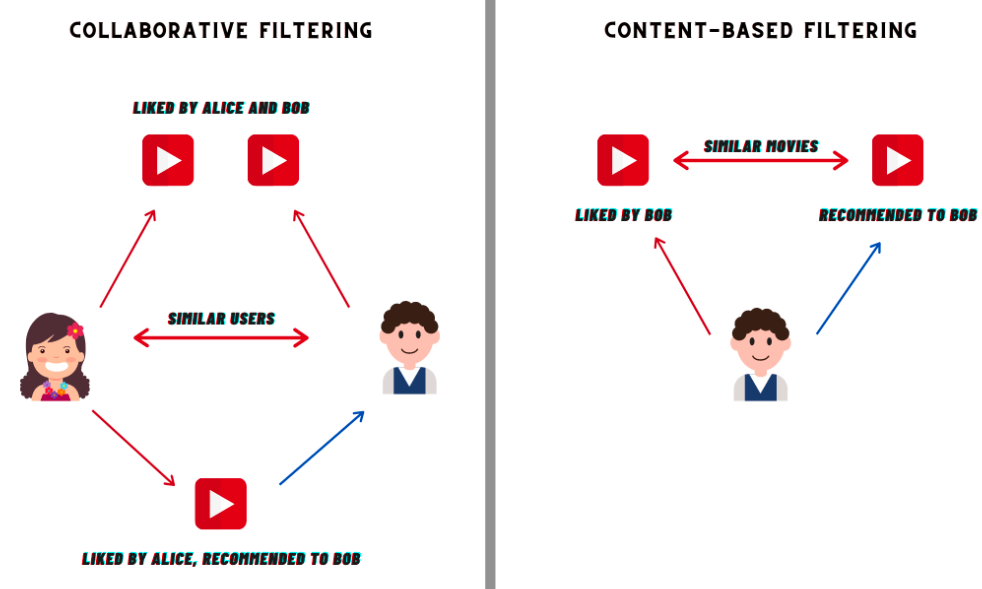
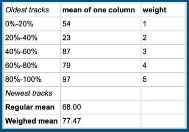

# Welcome to our Music Recommendation music
If you want to learn how this magical system works, keep reading, and listening!

When you enter the system or click the Refresh button, the Algorithm gets your request, and does the following:

## Get Recommendation by User Listening History
This method is also known as Content-Based Filtering (see the picture above). 
In this method, we characterize the user's listening history and find similar songs to the ones the user liked in the past.

### Pre-Steps
  - For each songs, we made sure we have it's Audio Feature Information (you can read more about it [here](https://www.kaggle.com/datasets/amitanshjoshi/spotify-1million-tracks?source=post_page-----5780cabfe194--------------------------------) and 
[here](https://developer.spotify.com/documentation/web-api/reference/get-audio-features)) 
  - Each time the user likes or removes likes from certain tracks
  - Calculate the mean values of his liked tracks.
  - If user has been using the App for a substantial period of time (more than a week, a month, a year...), the algo will calculate a weighted mean vector, which takes into account, that latter liked tracks will have a greater influence of the "average taste of the user".
  - 
  - Upsert the vector into [Pinecone VectorDB](https://docs.pinecone.io/home). Meaning, if the user exists in VectorDB `users` Index, we `UPDATE` the record, else, we `INSERT` it.

### Steps

- Get the user's mean vector from VectorDB `users` Index by user id.
- Query the VectorDB `tracks` by similarity to the current_user_mean_vector.
- Get the top `k` most similar tracks.
- Get the textual data (like track name, artist name, etc...) from RDS DB.
- Show the recommendations.

## Get Recommendation by Similar Users
This method is known as Collaborative Filtering. 
In this method, we characterize the **user** and find similar users whose songs we recommend to the current user.

### Steps

- 