# Music Recommendation System Algorithm UI walkthrough 

The Client is written in plain HTML, CSS, JAVASCRIPT 

## Our web-app
Our web app host on [Heroku](https://dashboard.heroku.com/)  server.

Link to the web-app https://music-application-e6959040ee86.herokuapp.com/
 ____
Before we dive into the walkthrough, we'd like to highlight the attention and care given to the development of our web app UI. We focused on design, simplicity, user experience (UX), and interactivity to ensure a smooth and enjoyable user experience. Although it was challenging, we are thrilled with the results and hope you will be too!
____

## Login Page
After the user successfully logs in, their session is managed using the web's local cache, storing their user_id and user_name. For security reasons, each user interaction with the UI involves a backend check to verify and authenticate the user. Since the local cache is editable, these backend validations are essential to ensure the security of the web app.

## Login Page Validation
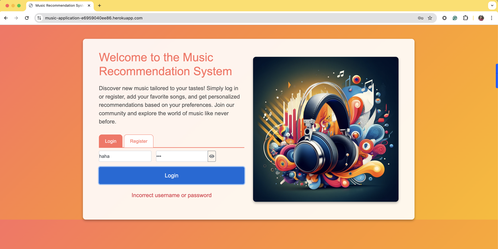

## Sign-up Page
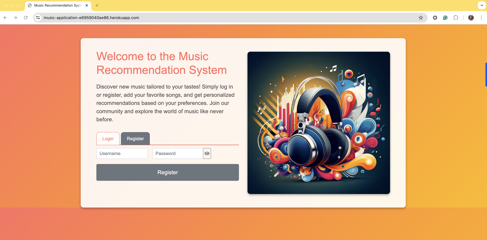

## Login Page Validation
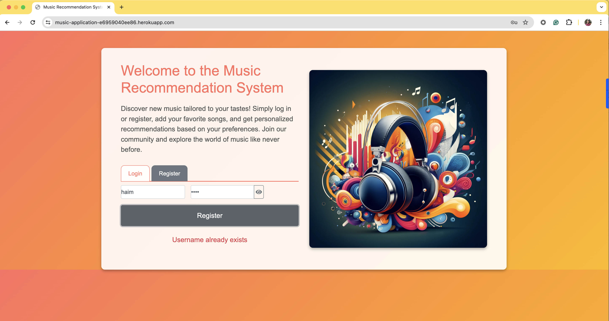

## recommendation Page 

## Add single spotify track link to Favorites list 

#### Insert the spotify track link in the input text
Notes: 
- We can only add tracks from spotify
- The tracks must be from the 1M dataset from **Spotify_1Million_Tracks** dataset from [Kaggle](https://www.kaggle.com/datasets/amitanshjoshi/spotify-1million-tracks?source=post_page-----5780cabfe194--------------------------------).
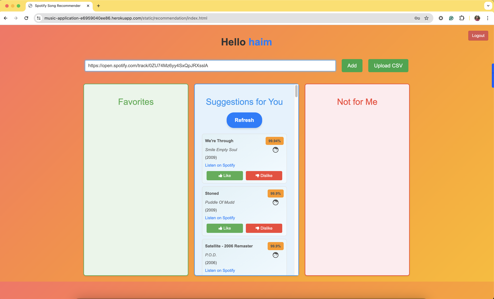

    #### Popup approval the track was added (By click the add button)
    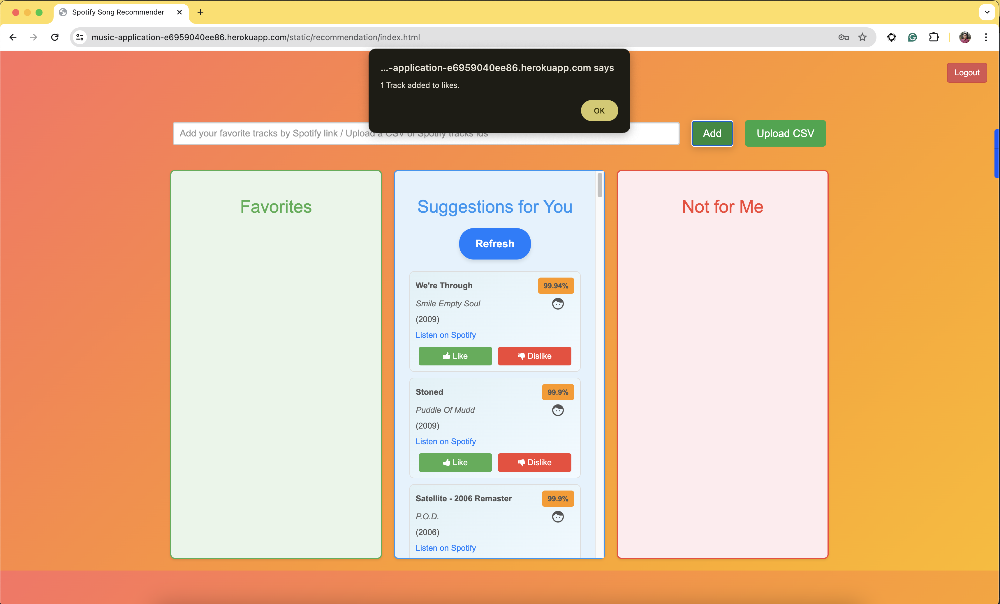
    
    ### The track added to the favorites list
    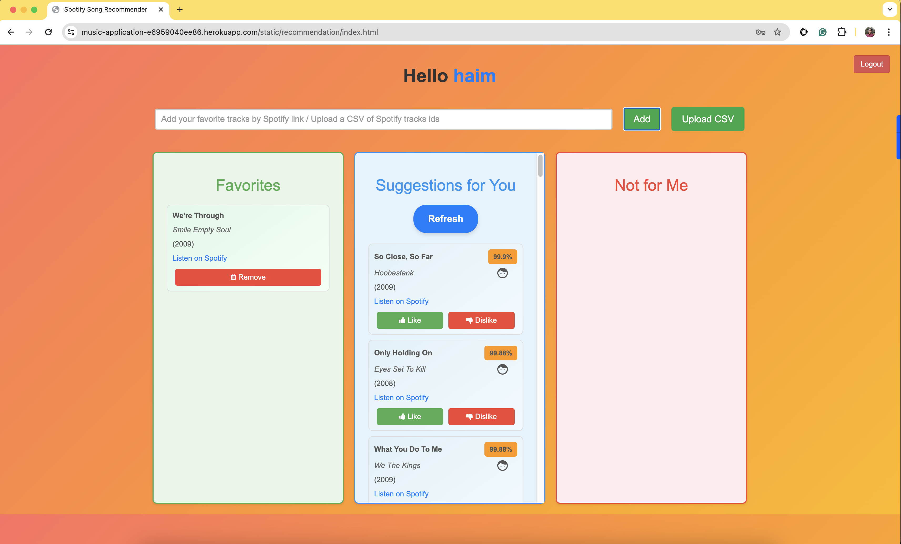
* The recommendation list refresh automatically

## Add multi spotify tracks to Favorites list 

#### Insert spotify track links using upload csv (Click upload csv button)
Notes: 
- The csv format should be one column, with `links` title
- The values of the column should be spotify tracks links, one at a row
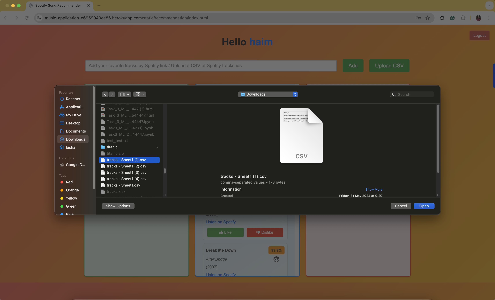

    #### Choose csv file window  from the file system (Click open)
    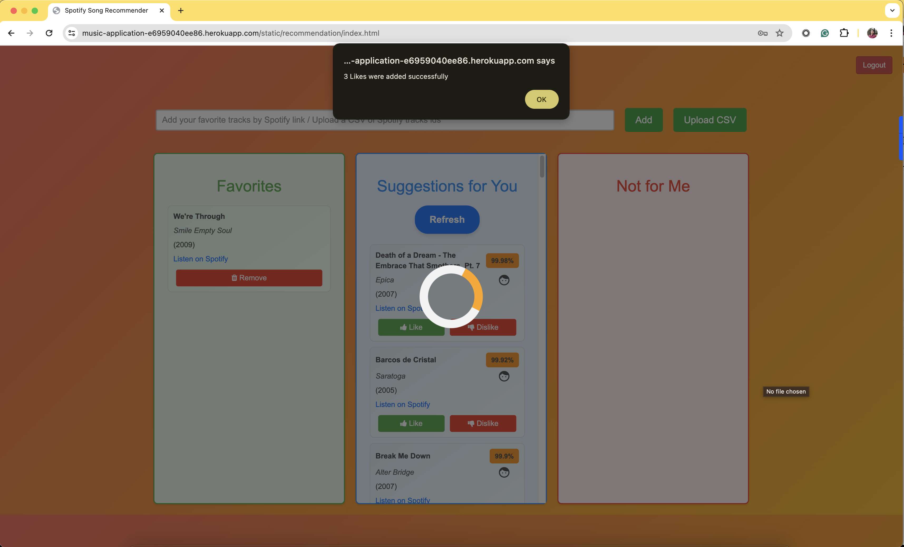
    
    ### The tracks added to the favorites list
    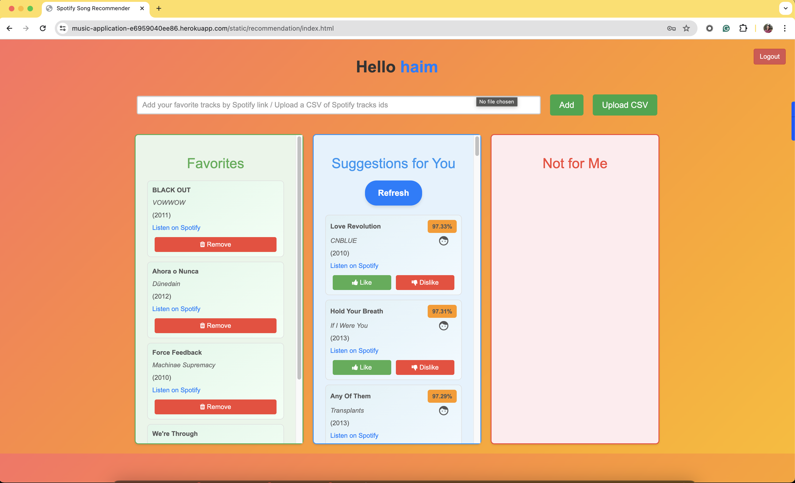
* The recommendation list refresh automatically 

## Click like/dislike from the recommendation list, move the tracks to the relevant list
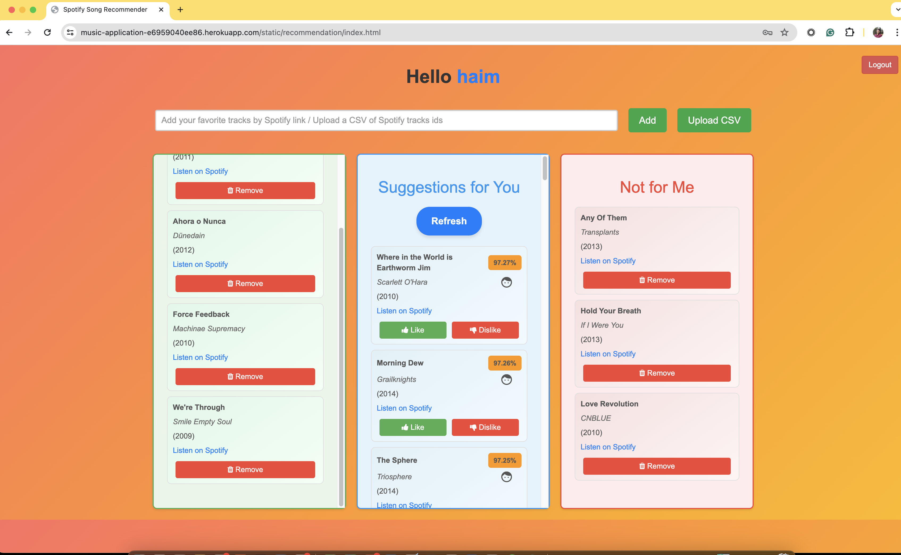

### Click the Refresh button
* All the time suggest brand-new recommendations based on the user favorites tracks
* Each recommended track item in the recommendation list consist of:
  * Metadata regarding the track (name, band, year of publish)
  * Link to listen on Spotify
  * Match percentage for the user
  * Small icon indicate the source recommendation logic this track item originated from
  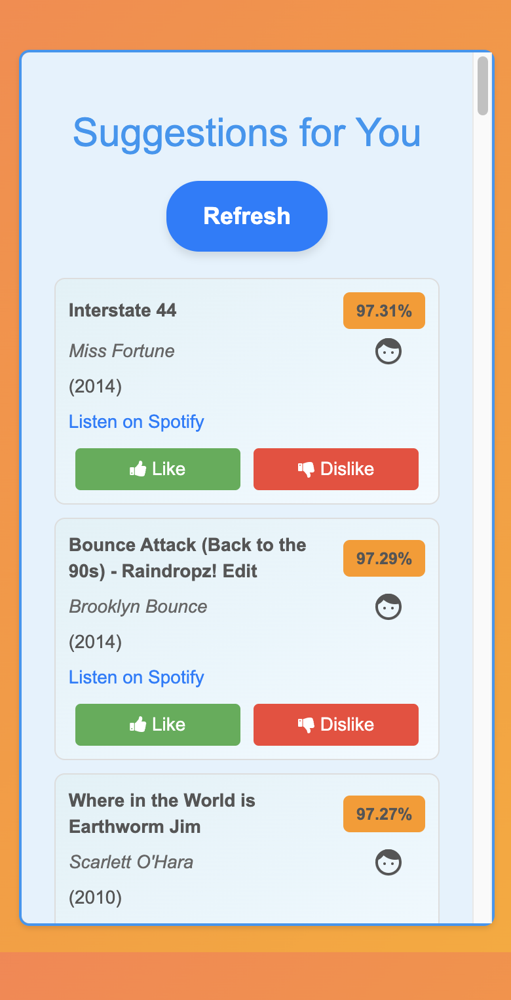

* Clicking the logout button (in the top right corner) will disconnect the user and take him back to the login page